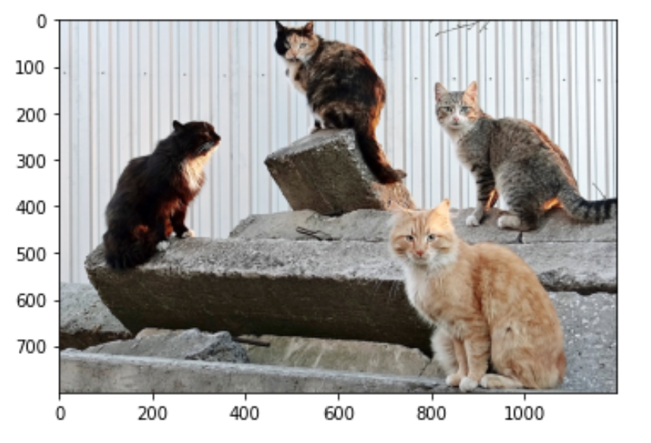
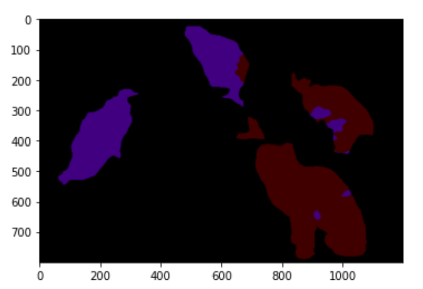

# PSPNet-Pytorch
 
Pyramid Scene Parsing Network with pytorch
 
## Description
 
This is a semantic segmentation model that uses a pyramid structure.
It can learn object recognition using image and annotation data such as coco-dataset.

 

Click here for details: https://hszhao.github.io/projects/pspnet/
 
## Requirement
 
- python==3.9.7
- torch==1.10.2+cu113
- torchvision==0.11.3+cu113
- torchinfo==1.6.3

 
## Usage
 
You can rewrite train.py and data_loader.py to train the segmentation data.
 
## Author
 
[@HarunoriKawano](https://twitter.com/HarunoriKawano)
mail to: harunori.kawano.business@gmail.com

## Reference
- Hengshuang Zhao et al(2017). Pyramid Scene Parsing Network. CVPR2017
- 小川雄太郎(2020). Pytorchによる発展ディープラーニング. 株式会社マイナビ, 503p
- Kaiming He et al(2015). Deep Residual Learning for Image Recognition. 